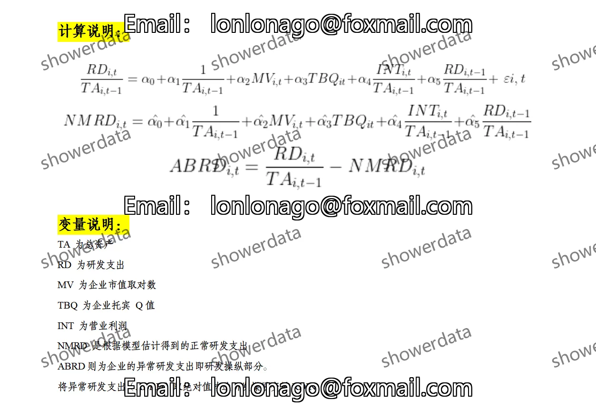
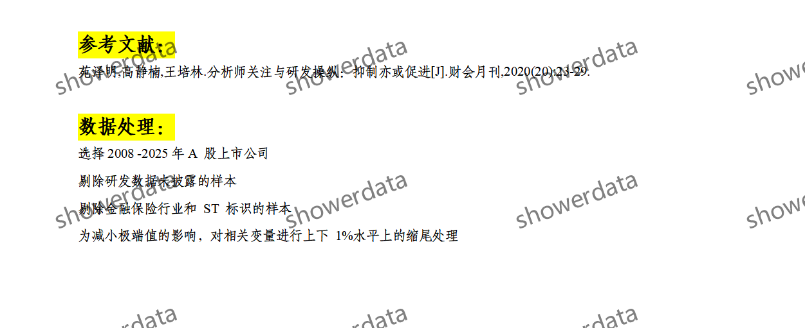
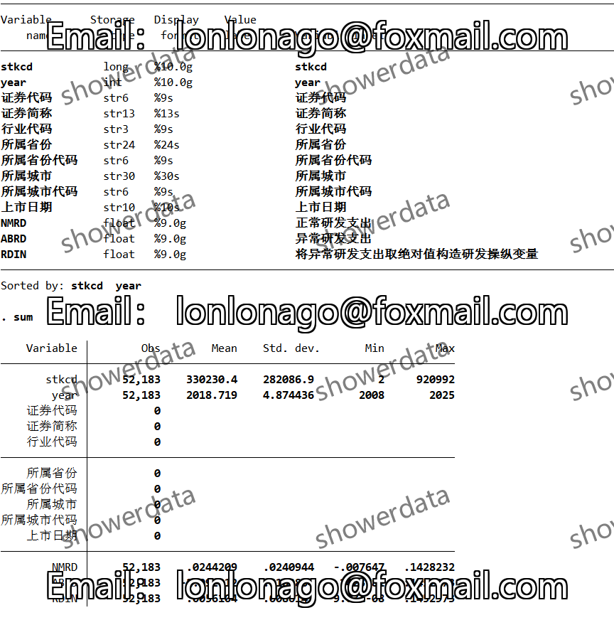
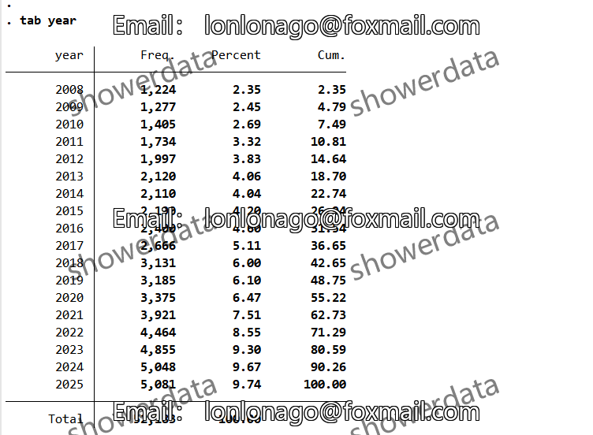
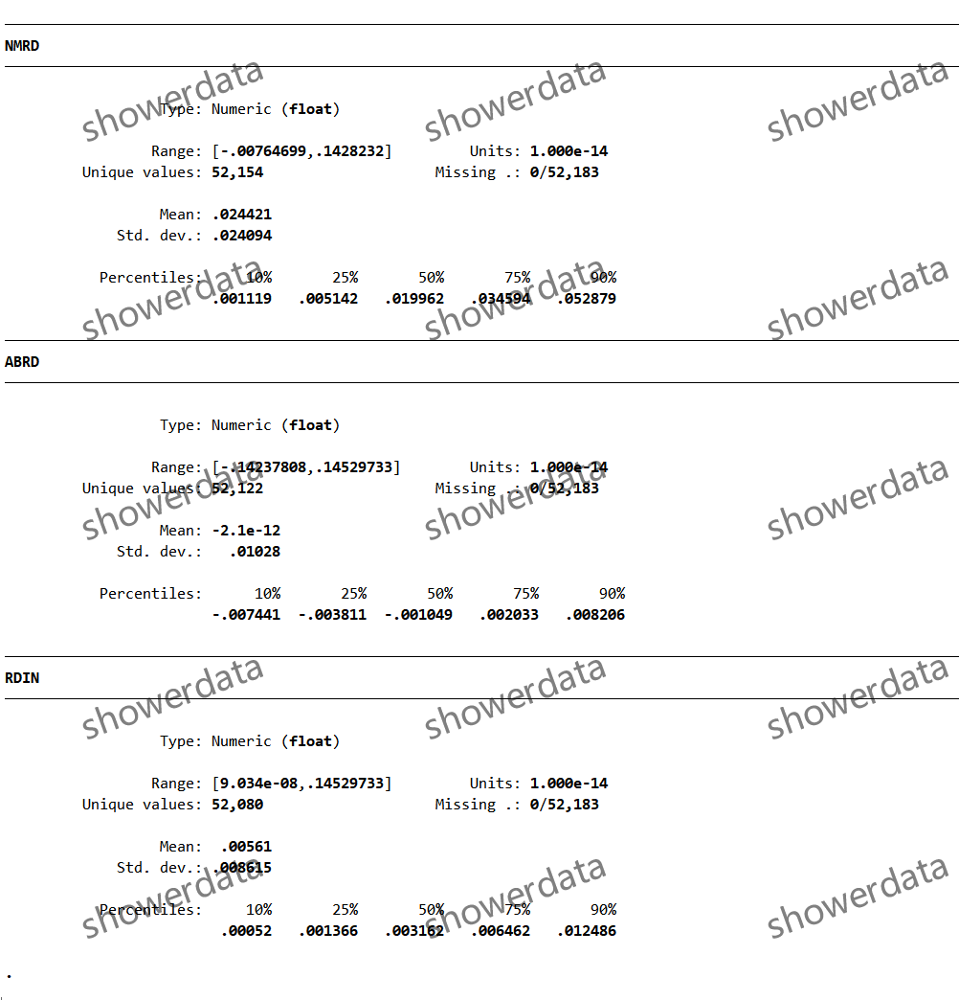
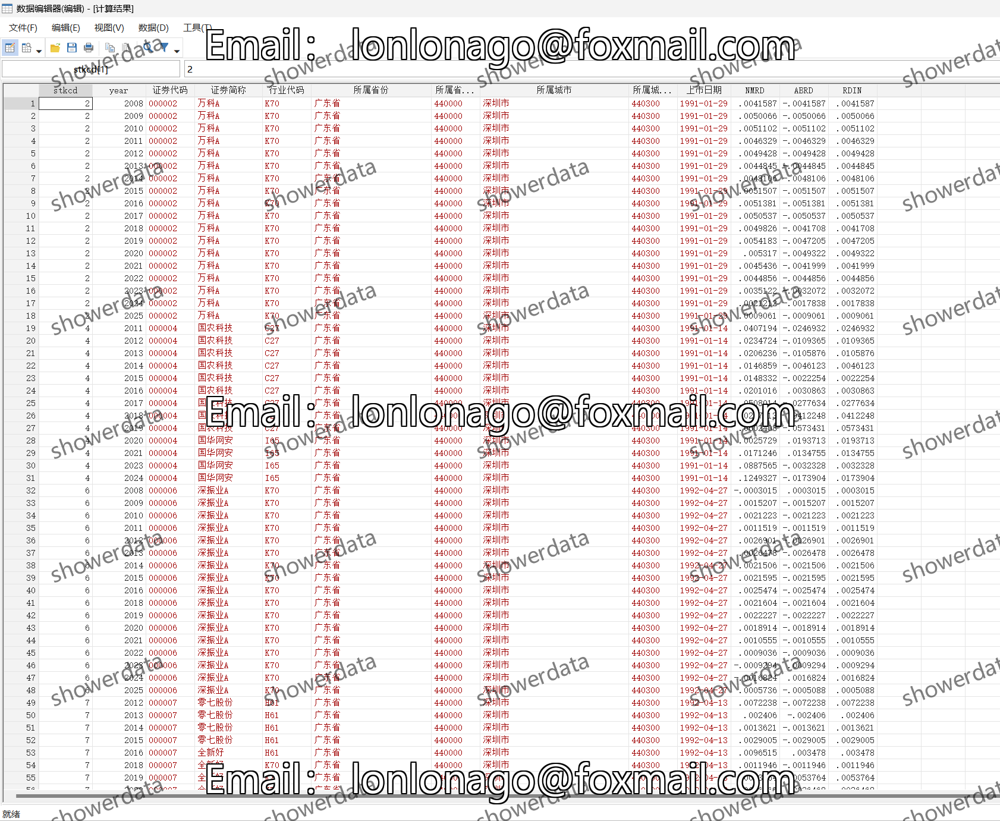
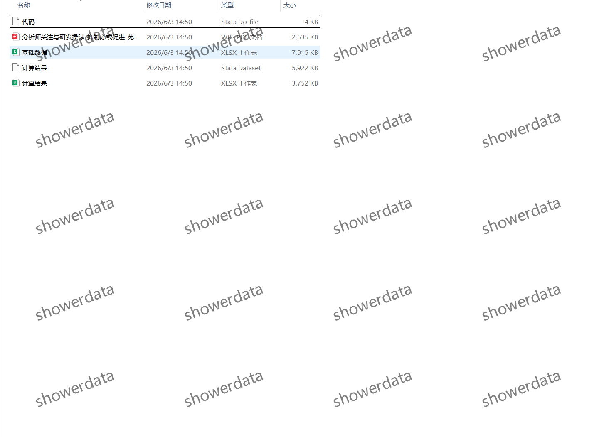

## Body

（2008-2025年）上市公司-企业研发操纵计算数据

After purchase, no reason can be refunded. There may be missing values, please check before purchasing or ask clearly before buying! The display results are not deducted and truncated.

I. Data Introduction
(1) Details of the data: See the image below, please check before purchasing! The displayed information is for reference only. Please confirm if it is what you need before purchasing! No returns or exchanges will be accepted for any reason after shipment. Please confirm that you will use it before purchasing, without providing answers to questions, thank you! There may be missing values caused by objective reasons, those who are sensitive to this should not purchase, thank you!
(2) Name of the data: List of corporate R&D manipulation calculation data for listed companies
(3) Sample range: A company on the drum
(4) Time range: 2008-2025
(5) Data format: Excel, DTA
(6) Data content: Results, References, Raw data, Codes

II. Data Results Indicators as shown in the figure

III. Method of indicator construction as shown in the figure

IV. References as shown in the figure

## Images

Here is a pay link on Stripe ( https://buy.stripe.com/3cs8yP7sY87d0vu9AB ). Please contact me lonlonago@foxmail.com after funding $89, and I will send you a complete data files , thank you!

